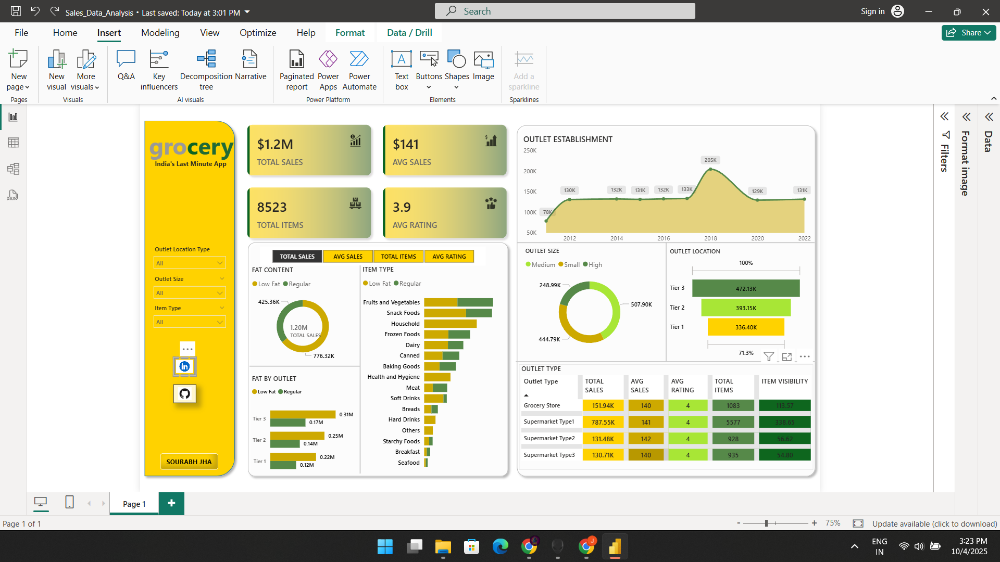

# Grocery_Sales_Analysis-Using-PowerBi
Interactive Power BI dashboard for Grocery sales analysis. This project visualizes KPIs like total revenue and ratings, exploring sales performance by item type, outlet size, and location. Features data cleaning with Power Query, custom DAX measures, and dynamic filters for a comprehensive business intelligence report.

Dashboard Screenshot

Key Features & KPIs

The dashboard offers a multi-faceted view of the business through a range of interactive features and key performance indicators:

* **KPIs**: At-a-glance cards for **Total Sales**, **Average Sales**, **Total Items Sold**, and **Average Customer Rating**.
* **Dynamic Slicers**: The entire report can be filtered by:
    * Outlet Location (Tier 1, Tier 2, Tier 3)
    * Outlet Size (Small, Medium, High)
    * Item Type (e.g., Dairy, Snacks, Household)
* **Product Analysis**: Visuals breaking down sales by product **Fat Content** (Low Fat vs. Regular) and overall **Item Type**.
* **Outlet Performance**: In-depth analysis of sales performance based on an outlet's **Establishment Year**, **Size**, **Location**, and **Type**.
* **Interactive Experience**: All visuals are configured to cross-filter the report, enabling a seamless and intuitive deep-dive analysis.

## Technical Stack

* **Business Intelligence**: Microsoft Power BI Desktop
* **Data Transformation (ETL)**: Power Query
* **Calculations & Modeling**: Data Analysis Expressions (DAX)

## Project Workflow

1.  **Requirement Gathering**: Identified the key business questions and KPIs for the analysis.
2.  **Data Cleaning**: Connected to the Excel data source and performed data cleaning and transformation using Power Query to resolve inconsistencies and prepare the data for analysis.
3.  **DAX Measures**: Developed robust measures using DAX to calculate all primary KPIs and support the visual analysis.
4.  **Dashboard Development**: Designed an intuitive, user-friendly dashboard with a variety of appropriate charts (Donut, Bar, Line, Funnel, Matrix).
5.  **Insight Generation**: Analyzed the final dashboard to extract actionable business insights.

## Key Insights from the Analysis

* **Top-Selling Categories**: `Fruits & Vegetables` and `Snack Foods` are the most significant contributors to sales volume.
* **Geographic Performance**: `Tier 3` city outlets generate the highest sales, highlighting a strong market presence in those areas.
* **Outlet Vintage**: Outlets established in the year `2018` show the best sales performance.
* **Optimal Outlet Size**: `Medium-sized` outlets account for the largest portion of total sales, indicating an effective operational scale.

## How to Use

1.  Clone this repository or download the `.pbix` file.
2.  Open the `Sales_Data_Analysis.pbix` file using Power BI Desktop.
3.  Interact with the slicers and visuals to explore the data.
